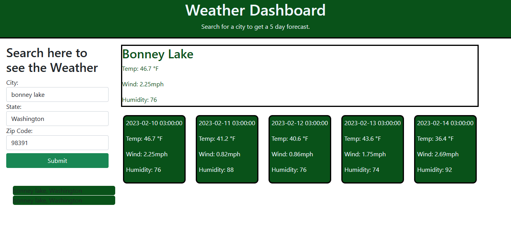

# Weather Dashboard

## In this project I created an app that lets the user search a city by name and will get the current weather along with a 5 day weather forecast. It also has a search history list wich can also be clicked to re render results. I did this by calling the open weather api.

https://github.com/Karlfranzia/weather-dashboard